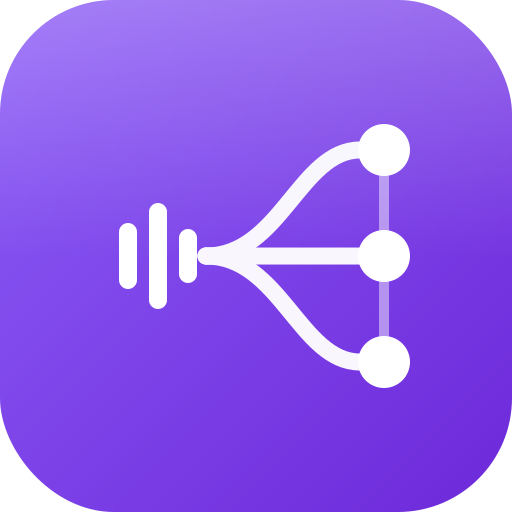

<p align="center">
  
</p>

<h1 align="center">OutputsSync</h1>

<p align="center">
  <b>Une sortie multiple parfaite pour macOS.</b><br>
  Envoie le même son sur plusieurs appareils à la fois — haut-parleurs, TV/HDMI,
  enceinte Bluetooth — <b>synchronisés</b> grâce à un délai réglable par appareil.
</p>

<p align="center">
  
  
  
</p>

---

## Ce que ça fait

- 🔊 **Multi-sortie simultanée** : coche les appareils, le son sort de tous en même temps.
- ⏱️ **Synchronisation par appareil** : un délai (0–500 ms) par sortie pour aligner
  celles qui sont en retard (Bluetooth, TV/HDMI) sur les plus rapides.
- 🎚️ **Volume maître + volume par appareil**, et **contrôle par les touches système**
  (F11/F12) : « OutputsSync Nightly » est un vrai périphérique que tu sélectionnes
  comme sortie, dont le volume répond au clavier.
- 🕹️ **Choix de l'horloge maître** : décide quel appareil cadence l'agrégat.
- 🧭 **Alignement automatique** depuis la latence rapportée par CoreAudio (idéal
  HDMI/AirPods), affinable à la main pour du Bluetooth générique.
- 🌐 **Mode réseau local (salon)** : crée un **salon** (nom + code PIN) — **tu es
  la source, c'est toi qui mets le son** — et diffuse-le vers les **enceintes** du
  salon (tes sorties locales + les Mac qui te rejoignent), gardées synchronisées
  par une **horloge commune**. Un bouton **Sync** ré-aligne tout d'un geste. Voir
  [docs/NETWORK.md](docs/NETWORK.md).

## Comment ça marche

`OutputsSync Nightly` est un **driver audio loopback** : tes apps y jouent (tu le
règles comme sortie système), il reboucle le mix vers son entrée, et l'app lit
cette entrée pour la **redistribuer** vers les sorties cochées, chacune avec son
délai et son volume. Le contrôle de volume du driver est relié aux touches
système et son gain est appliqué au son redistribué.

```
Apps ─▶ [ OutputsSync Nightly ]  (sortie système, volume = F11/F12)
             │  loopback interne
             ▼
        App OutputsSync ──┬─▶ Haut-parleurs   +0 ms   × vol
   (délai + volume/appareil)├─▶ Enceinte filaire +X ms × vol
                           └─▶ Bluetooth        +Y ms  × vol
```

> ℹ️ macOS affiche une **pastille micro orange** quand l'app tourne : lire l'audio
> pour le redistribuer compte comme une « entrée ». C'est normal, aucun micro
> réel n'est utilisé. (La variante sans pastille demanderait de la mémoire
> partagée, bloquée par le sandbox de coreaudiod sur macOS récent.)

## Mode réseau (LAN)

Le modèle est simple — **une source, des enceintes** :

- **Créer un salon** → **tu es la source** (c'est toi qui mets le son). Tu choisis
  quelles **enceintes** jouent ton son : tes **sorties locales** (enceintes, BT,
  HDMI…) **et** les **Mac** qui ont rejoint le salon, cochés dans une seule liste.
  Ton son sort partout en même temps, synchronisé. Le **PIN est optionnel** (sans
  PIN, le salon est ouvert). Émettre demande le driver comme sortie système.
- **Rejoindre un salon** (depuis la liste détectée par Bonjour ; PIN si requis) →
  **tu deviens une enceinte**. Tu choisis simplement **sur quelle sortie locale**
  jouer le son de la source. Écouter ne demande **pas** le driver.
- Bouton **Sync** (dans le salon) : **ré-aligne toutes les enceintes** sur
  l'horloge commune en un geste — pratique après une dérive, un rebranchement ou
  un changement de sortie.

```
Source ──▶ capture loopback ──UDP──▶ Enceinte (Mac) ──▶ sortie locale
       (horodaté en heure-room)     (programmé sur l'instant de présentation)
```

- **Synchro propre** : une horloge commune (type NTP) aligne les machines au
  sub-ms, et un resampler verrouille la lecture pour éviter la dérive.
- **Latence** : PCM bit-perfect + délai de playout adaptatif (le plus bas que le
  réseau permet).
- **Sécurité** : rejoindre exige le **code PIN** du salon (s'il en a un).
- Première utilisation : macOS demande l'autorisation **« réseau local »**.

Détails d'architecture : [docs/NETWORK.md](docs/NETWORK.md).

## Installation

### Homebrew (recommandé)

```bash
brew install --cask sohakolan/outputssync/outputssync
```

Puis lance **OutputsSync** : au premier démarrage, s'il manque, il te propose
d'installer le driver (mot de passe admin requis, redémarre le serveur audio).

### DMG

Télécharge le `.dmg` depuis les [Releases](https://github.com/sohakolan/OutputsSync/releases),
glisse **OutputsSync** dans Applications, lance-le.

> App signée ad-hoc (non notarisée) : au 1ᵉʳ lancement, fais **clic droit → Ouvrir**.

## Utiliser

1. Règle **OutputsSync Nightly** comme sortie système (menu son / Réglages → Son).
2. Clique l'icône ∿ dans la barre de menus.
3. Coche tes sorties, choisis l'**horloge** (icône ⏱️), règle **volumes** et **délais**
   (ou **Sync auto**).
4. **Activer.** Le son sort de toutes les sorties cochées, synchronisées ; F11/F12
   règlent le volume.

## Construire depuis les sources

```bash
make help              # liste toutes les cibles
make app               # -> "OutputsSync Nightly.app"
make driver            # -> build/OutputsSyncDriver.driver
make install-driver    # sudo + redémarre coreaudiod
make selftest          # auto-test de la ligne à retard (sans audio ni GUI)
```

## Limites connues

- **Formats Float32 stéréo, 48 kHz** supposés (cas standard).
- **Pastille micro** inévitable (voir plus haut).
- Le **Bluetooth** a une latence variable et peut dériver : l'app compense la
  dérive et te laisse ajuster le délai, mais un affinage manuel occasionnel peut
  être nécessaire — inhérent au Bluetooth.
- App **non notarisée** (clic droit → Ouvrir au 1ᵉʳ lancement).

## Structure

```
Driver/OutputsSyncDriver/
  OutputsSyncDriver.c   AudioServerPlugIn loopback (entrée+sortie) + contrôle volume
  Info.plist            Factory + type AudioServerPlugIn
Sources/OutputsSyncNightly/
  CoreAudio/SyncEngine.swift    Agrégat + IOProc + délai/volume par appareil
  CoreAudio/Controls.swift      État partagé UI⇄audio + ligne à retard
  CoreAudio/AudioDevices.swift  Énumération + volume des périphériques
  UI/ContentView.swift          Interface (sorties, horloge, volumes, délais)
  AppState.swift                Logique appli + installation du driver
scripts/                        bundle.sh, build-driver.sh, install/uninstall
```

## Licence

MIT — voir [LICENSE](LICENSE).
